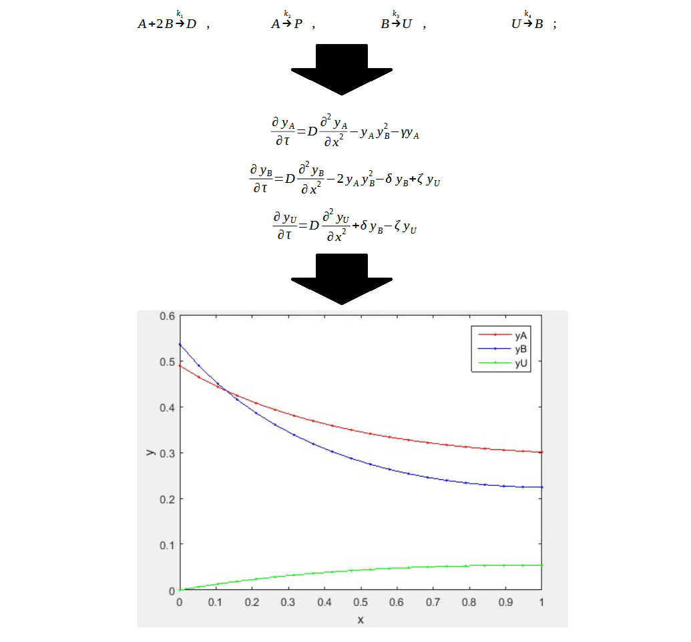

# Membrane Plug Flow Reactor Concentration Project
## Brief Description
This was a project and report completed as part of a Chemical Engineering 109 (Numerical and Mathematical Methods) course that modeled and analyzed the concentration profiles of chemical species within a membrane plug flow reactor(PFR) based on their accumulation, reaction kinetics, and mass diffusion. See the [report.pdf](./report.pdf) file for an overview of what the code in this repository does and how it was written.

Concentration Profiles Over Time:

https://github.com/mattacer/ReactorConcentrationProject/blob/master/ConcentrationsOverTime.mp4?raw=true

## Related Mathematics Topics:
* Parabolic Equations
* Ordinary Differential Equations
* Partial Differential Equations
* Systems of Equations
* Matrix Operations
* Centered Finite Difference Approximations
* Mulivariate Newton's Method
* LU Decomposition
* Explicit Euler's Method

## Related Chemistry Topics:
* Reaction Kinetics

## Related Chemical Engineering Topics:
* Mass Diffusion
* Transport Phenomena
* Mass Balances
* System of Equations From Physical Properties
* Boundary Conditions
* Nondimensionlization
* Numerical Analysis

## Related Computer Science Topics:
* Error Estimation and Mitigation
* Big O Approximations
* Matlab
* Functional Programming
* Numerical Integration
